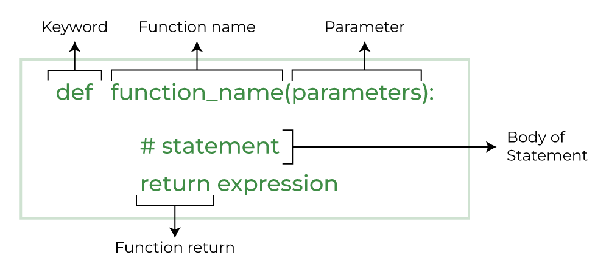

# Functions

Why are functions used in programming?
- Code Reusablity: you can define code that can be used over and over again
- Readability: it is easier to understand the code if it is combined in blocks
- Modularity: you don't have all the code as one big text, but structured in modules
- Maintainability: if you change some parts of the code in a function, you know it affects the function only. Also: you can test the funtion independently



### 👨‍💻 TASK 1: Create a Python File
Open your terminal and create a file:
touch functions_exercise.py

or in VS Code:
File -> New File

## Exercise

### 👨‍💻 TASK 1: Simple Function

Inside functions_exercise.py, type:
```
def greet():
    print("Hello, welcome to Python functions!")

greet()
```

Save, then run:

python functions_exercise.py


Try: Change the message and run again.

### 👨‍💻 TASK 2: Function with Parameters
```
def greet_person(name):
    print(f"Hello, {name}!")

greet_person("Alice")
greet_person("Bob")
```

Challenge: Modify this function to take first and last name and print a full greeting.

### 👨‍💻 TASK 3: Function with Return Value
```
def add(a, b):
    return a + b

result = add(5, 7)
print("Sum:", result)
```

Try: Write similar functions for subtract, multiply, and divide.

### 👨‍💻 TASK 4: Default Arguments
```
def greet(name="Guest"):
    print(f"Hello, {name}!")

greet("Alice")
greet()
```

Challenge: Write a function power(base, exponent=2) that returns base raised to exponent. Test with and without the second argument.

### 👨‍💻 TASK 5: Multiple Return Values
```
def calculate(a, b):
    sum_ = a + b
    diff = a - b
    product = a * b
    return sum_, diff, product

s, d, p = calculate(10, 3)
print("Sum:", s, "Diff:", d, "Product:", p)
```

Try: Extend the function to also return the quotient (a / b).

### 👨‍💻 TASK 6: Function with List Input
```
def print_list_element(items, index):
    print(item[index])

fruits = ["apple", "banana", "cherry"]
print_list_element(fruits, 0)
```

Challenge: Write a function that returns the largest number in a list.

### 👨‍💻 TASK 7: Mini-Project — Simple Calculator

Create a file calculator.py:
```
def add(a, b):
    return a + b

def subtract(a, b):
    return a - b

def multiply(a, b):
    return a * b

def divide(a, b):
    return a / b

# Testing the functions
print("Add:", add(10, 5))
print("Subtract:", subtract(10, 5))
print("Multiply:", multiply(10, 5))
print("Divide:", divide(10, 5))
```

Run it:
```
python calculator.py
```

Challenge: Modify the file so the user inputs numbers and chooses an operation.

### 👨‍💻 TASK 8: Organizing Functions

Create a file math_utils.py with functions add, subtract, multiply, divide.

Create another file main.py and import the functions:
```
from math_utils import add, subtract

print(add(10, 5))
print(subtract(10, 5))
```

Challenge: Add multiply and divide to the import and test them.

✅ Tips for Students

Save the file before running it.

Use print statements to see what your functions are returning.

Experiment with parameters, return values, and default arguments.

Split large projects into multiple .py files to practice modular programming.