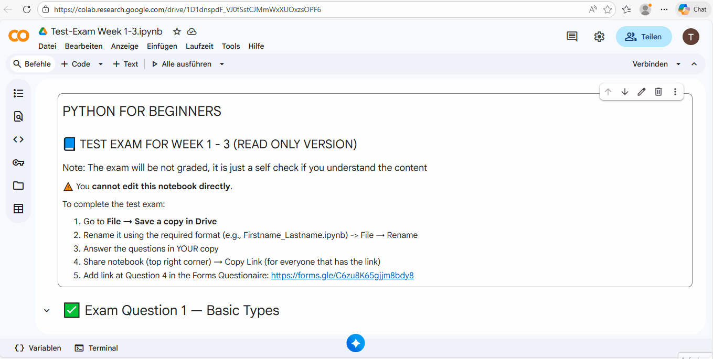

# Week 3

## Hands on
1. [Install Extensions](0_hands_on_install_extensions.md)
1. [Variable Scope](1_hands_on_variable_scope.md)
1. [Debugging](2_hands_on_debugging.md)
1. [Dictionaries](3_hands_on_dictionaries.md)

## Homework
1. [Dictionaries](./homework/homework_dictionaries.md)

## Test exam
[Link to colab notebook](https://colab.research.google.com/drive/1D1dnspdF_VJ0tSstCJMmWxXUOxzsOPF6?usp=sharing)

Instructions:

