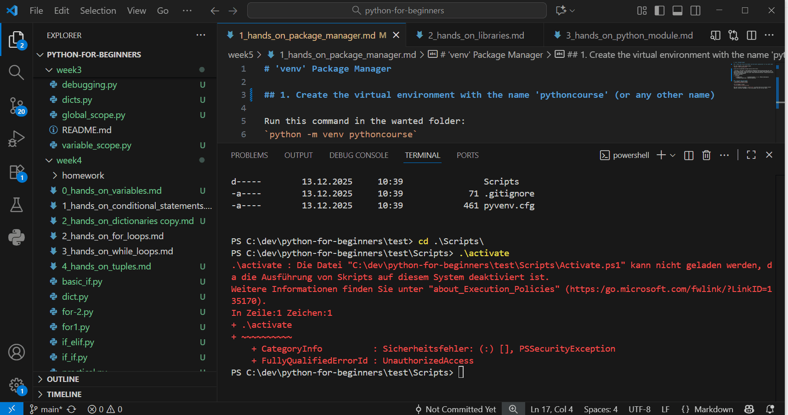

# 'venv' Package Manager

## 1. Create the virtual environment with the name 'pythoncourse' (or any other name)

Run this command in the wanted folder:
`python -m venv pythoncourse`


## 2. Activate the environment
🪟 On Windows (Command Prompt):
`pythoncourse\Scripts\activate`

🧑‍💻 On macOS or Linux:
`source pythoncourse/bin/activate`


If you are on powershell and get such an error error:
```
.\activate : Die Datei "C:\dev\python-for-beginners\test\Scripts\Activate.ps1" kann nicht geladen werden, da die Ausführung von Skripts auf diesem System deaktiviert ist.
Weitere Informationen finden Sie unter "about_Execution_Policies" (https:/go.microsoft.com/fwlink/?LinkID=135170).
In Zeile:1 Zeichen:1
+ .\activate
+ ~~~~~~~~~~
    + CategoryInfo          : Sicherheitsfehler: (:) [], PSSecurityException
    + FullyQualifiedErrorId : UnauthorizedAccess
```
then use Command Prompt (cmd):



Now your virtual environment `pythoncourse` is active and you can install project specific libraries (packages) in this environment (we will do this later).

