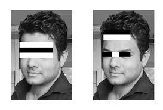

# 📷 Easy OpenCV Example: Open Camera & Detect Faces

This project:

- Opens your webcam
- Detects faces in real time
- Draws a rectangle around each face


## 📦 Step 1: Install OpenCV
```
pip install opencv-python
```
## 📁 Step 2: Get the Face Detection File

It is already in the folder, see:

[haarcascade_frontalface_default.xml](haarcascade_frontalface_default.xml)

### What is haarcascade_frontalface_default.xml?

haarcascade_frontalface_default.xml is a pre-trained face detection model used with OpenCV to detect human faces in images or video.

The XML contains:
- Thousands of Haar features
- Thresholds and weights
- Stages of the cascade

All learned during training on many face images



## 🧑‍💻 Step 3: Python Code (Beginner-Friendly)
```
import cv2

# Load the face detection model
face_cascade = cv2.CascadeClassifier(
    "haarcascade_frontalface_default.xml"
)

# Open the webcam
cap = cv2.VideoCapture(0)

while True:
    # Read frame from camera
    ret, frame = cap.read()

    # Convert to grayscale
    gray = cv2.cvtColor(frame, cv2.COLOR_BGR2GRAY)

    # Detect faces
    faces = face_cascade.detectMultiScale(
        gray,
        scaleFactor=1.3,
        minNeighbors=5
    )

    # Draw rectangles around faces
    for (x, y, w, h) in faces:
        cv2.rectangle(
            frame, (x, y), (x + w, y + h),
            (0, 255, 0), 2
        )

    # Show the video
    cv2.imshow("Face Detector", frame)

    # Press Q to quit
    if cv2.waitKey(1) & 0xFF == ord("q"):
        break

cap.release()
cv2.destroyAllWindows()
```
## ▶️ Run the program
```
python face_detector.py
```

A window opens → your webcam turns on → faces get detected 😎