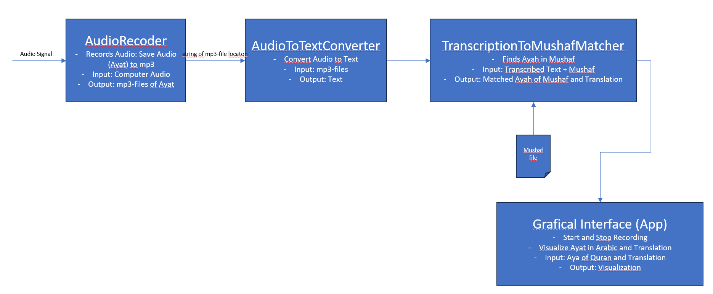
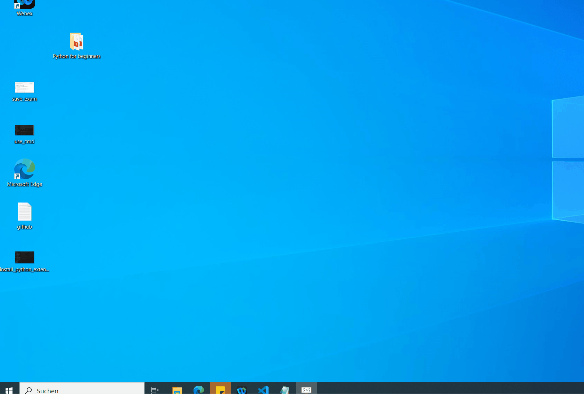

# Quran Audio-Text Assistant

## What it should do?
- Record Audio from your recitation (not implemented, currently just fixed mp3 file is used)
- Convert mp3 to text
- Find Ayah of your recitation in mushaf
- Visualize Ayah and English Translation in WebApp



## Installation
### Install libraries
```
pip install -r requirements.txt
```
### Download ffmpeg (most likely required)

#### 1️⃣ What is FFmpeg? (quickly)

FFmpeg is a powerful tool for:
- Converting video/audio formats
- Extracting audio
- Cutting, merging media

#### 2️⃣ Download FFmpeg (Windows)

Open your browser

Go to:
https://www.gyan.dev/ffmpeg/builds/

Download:
👉 ffmpeg-release-essentials.zip

(“Essentials” is enough for most users)

#### 3️⃣ Extract FFmpeg

Right-click the downloaded .zip

Click Extract All

Move the extracted folder to a simple location, for example:
```
C:\ffmpeg
```

Inside it you should see:
```
C:\ffmpeg\bin\ffmpeg.exe
```

✅ This file is the FFmpeg program

#### 4️⃣ Add ffmpeg folder to Path environment variable




-> Then Sign Out from Windows or Restart computer

#### 5️⃣ Verify installation

Run in terminal:
```
ffmpeg -version
```

✅ Correct output looks like:
ffmpeg version 6.x ...

If you see this → FFmpeg is installed correctly


## Run App
```
streamlit run app.py
```